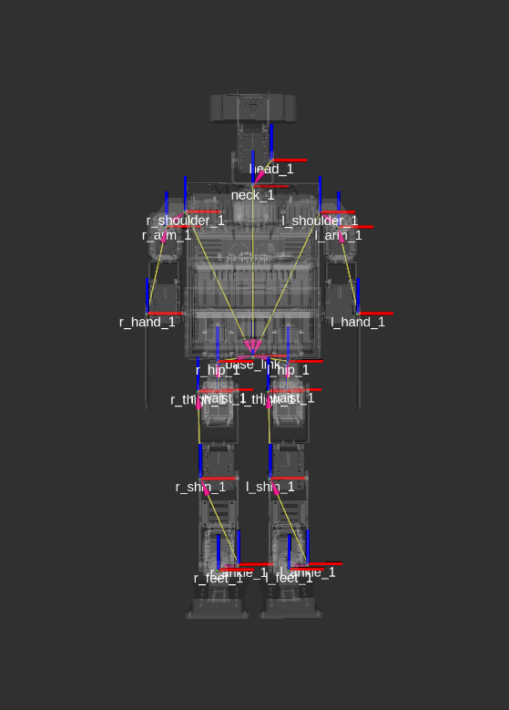
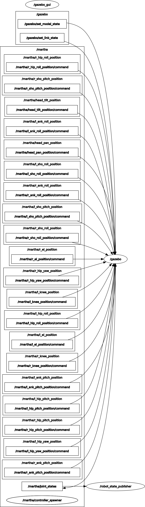
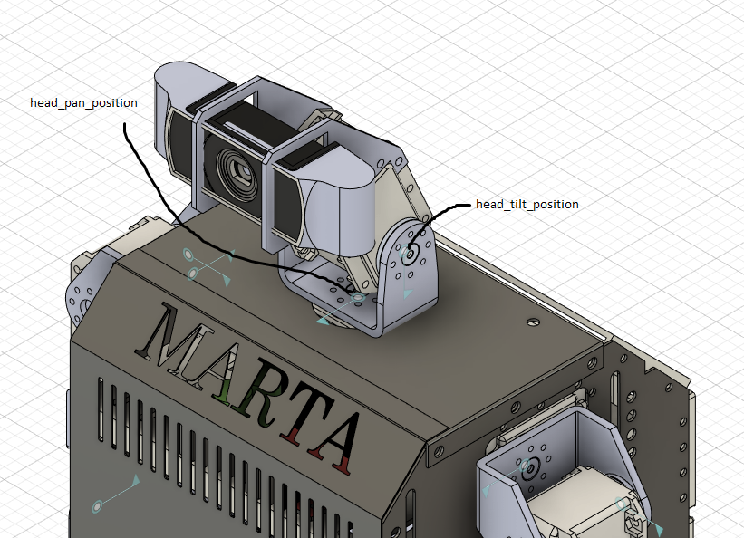
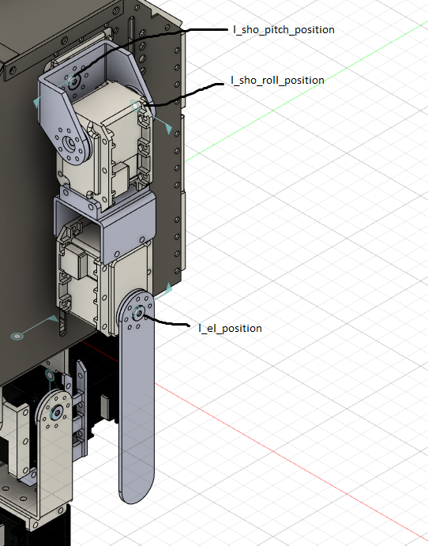
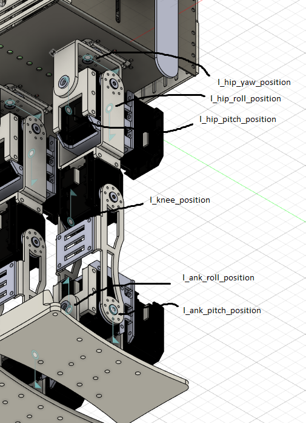

## marta_simulation

Este repositório fornece um ambiente de desenvolvimento voltado para simulações usando Gazebo com modelos e mundos customizados para o robo humanoid Martha.

## Índice

- [Simulação da Martha](#marta_simulation)
  - [Índice](#Índice)
  - [Introdução](#Introdução)
  - [Estrutura do Repositório](#estrutura-do-repositório)
  - [Requisitos](#requisitos)
  - [Getting Started](#getting-started)
    - [Clonando o Repositório e Compilando o Workspace nativo](#clonando-o-repositório-e-compilando-o-workspace-nativo)
    - [Clonando o Repositório e Compilando o Workspace via docker](#clonando-o-repositório-e-compilando-o-workspace-via-docker)
  - [Executando a simulação](#executando-a-simulação)
  - [Contribuindo](#Contribuindo)

## Introdução
Este projeto foi desenvolvido para fornecer um ambiente pronto para desenvolvimento e teste de simulações com a Martha no Gazebo utilizando ROS Noetic. O ambiente inclui todas as dependências necessárias, modelos personalizados e mundos de simulação para simplificar o fluxo de desenvolvimento.

## Estrutura do Repositório

- **docker/**: Contem arquivo de imagem Docker
- **Martha_ws/**: Workspace para simulação da Martha

## Requisitos

- Docker (opcional)
- Ubuntu 20.04
- Ros Noetic
- Gazebo-Classic
- ros_control

## Getting Started

### Clonando o Repositório e Compilando o Workspace nativo

Para clonar o Workspace execute
`git clone git@github.com:HumanoidPequi/marta_simulation.git`

instale também o `gazebo-ros-pkgs` e o `gazebo-plugins` com o comando

```
sudo apt-get install ros-noetic-gazebo-ros-pkgs ros-noetic-gazebo-plugins
```

Para compilar o workspace, dentro do repositorio marta_simulation acesse o diretorio Martha_ws e execute o build do workspace da seguinte forma:

```
//dentro do repositorio 
cd Martha_ws
catkin_make
```

Apos isso, execute o source do workspace
```
//dentro de Martha_ws
source devel/setup.bash
```

### Clonando o Repositório e Compilando o Workspace via docker

Dentro da raiz do repositorio, realize a build da imagem docker

`docker build -t martha_sim:1.0 -f docker/Dockerfile .`

Dentro da imagem docker execute a simulação


## Executando a simulação

Para executar a simulação, tanto docker quanto nativo, execute
`roslaunch martha_gazebo gazebo.launch`

## Estruturação dos controladores de posição

A martha possui 20 graus de liberdade, sendo cada grau de liberdade um link como mostrado na figura abaixo:



alem disso, cada link possui um controlador de posição, ou seja, para mudar a angulação de um dymaixel é necessário publicar o valor de ângulo desejado em um determinado topico da martha simulada. Os controladores de posição seguem a seguinte nomeclatura:

```
<l ou r>_<localização da junta>_<rotação roll, pitch ou yaw da junta>_position
```

Esses topicos são visualizaveis com o `rqt_graph` : 



A posição dos controladores são descritos nas seguintes imagens:





Para o lado direito, basta trocar l por r

## Contribuindo

Contribuições são bem-vindas! Por favor, envie um pull request ou abra uma issue se você encontrar problemas ou tiver sugestões para melhorias.